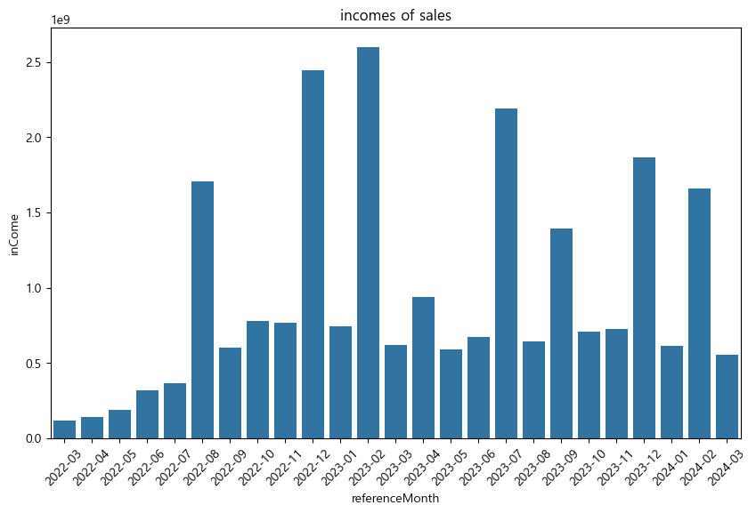
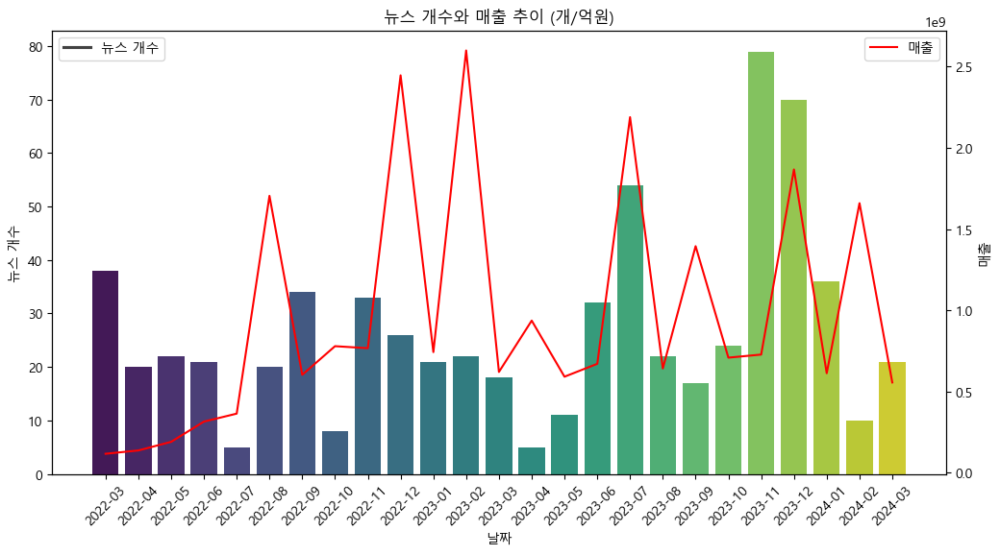
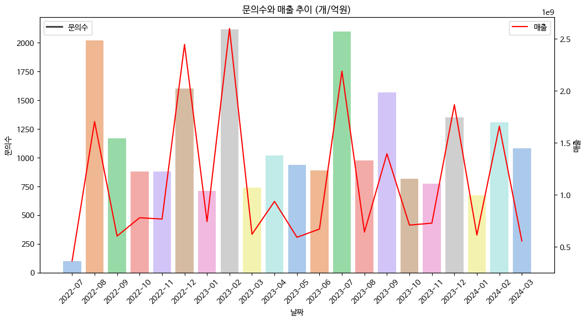
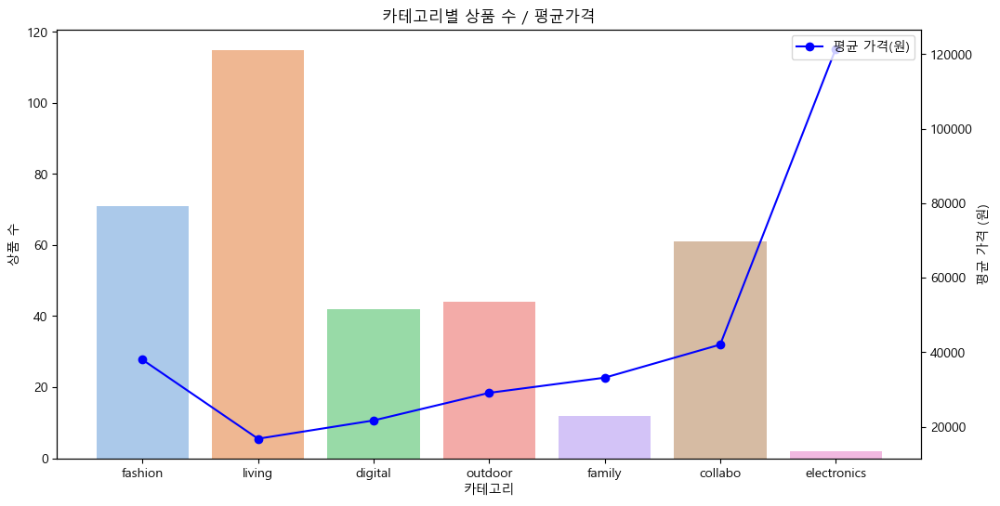
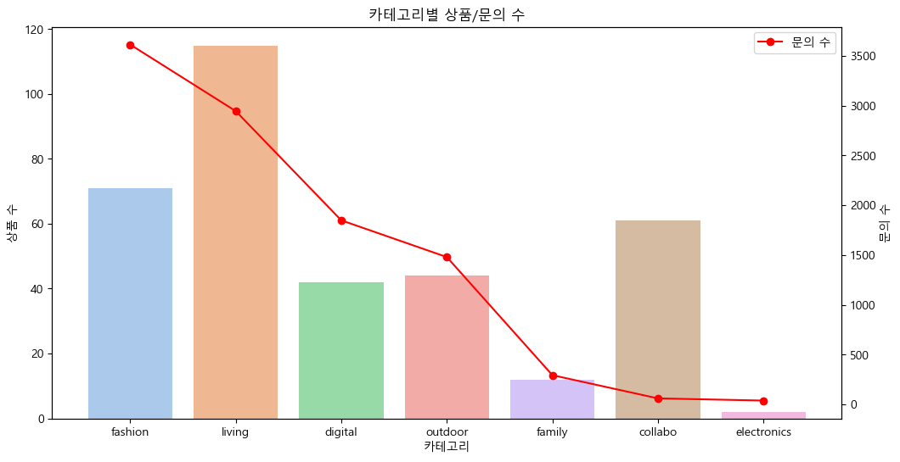
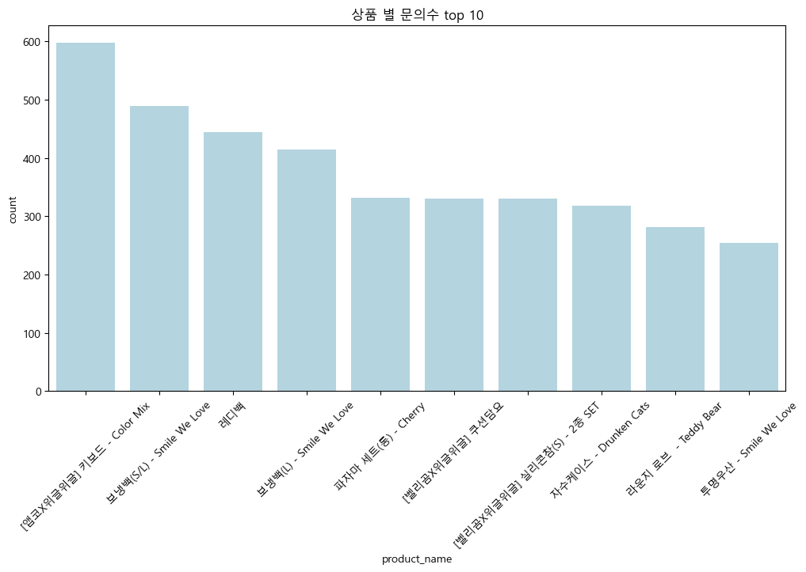
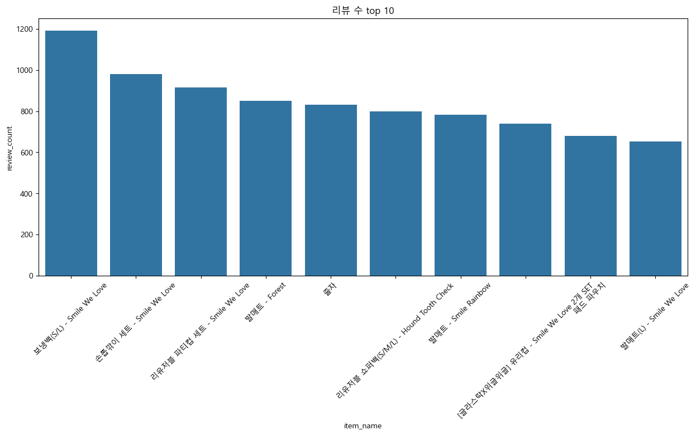
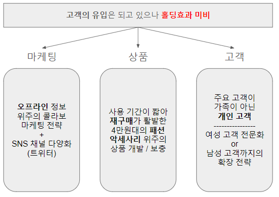

# 위글위글

산출물 : [위글위글 사이트 분석](https://docs.google.com/presentation/d/1vQkjJ4ZpbXQ93Z0kshkNwqHXAluf2LkIbf9y7y9aPow/edit#slide=id.p)

site : https://wiggle-wiggle.com/


## 1.개요

인터넷 상에 공개된 데이터들을 이용하여 '위글위글' 사이트에 대한 분석 / 전략을 제시한다.

## 2. 문제 확인



```
마케팅이나 이벤트 등으로 고객의 유입은 되고 있으나 홀딩효과 미비하여 매출이 들쭉날쭉하다.
```

## 3. 매출 분석

### 매출과 뉴스 분석



- LDA

```
Model : sklearn.decomposition.LatentDirichletAllocation
Scoring : gensim.models.coherencemodel.CoherenceModel
```

|월|토픽|
|---------|------------|
| 2022-08 | 서비스, 매출, CU, 여름, 호텔, 굿즈, 이벤트, 선물 |
| 2022-12 | 롯데, 칠성, 국민은행, 다이어리, 마주앙, 와인 |
| 2023-02 | 밸런타인, 신규, 세트, 캐릭터, 컬래버 |
| 2023-07 | 압구정, 스토어, LG, 캐릭터, 동성, 골프, 공항철도 |
| 2023-09 | 한가위, 추석, 편의점, 팝업스토어, 코레일 |
| 2023-12 | 신세계, 패션, 팝업스토어, 크리스마스 |
| 2024-02 | BHC, 스타필드, 브랜드, 고객, 수원 |


### 매출과 Q&A


```
매출수와 문의수를 비교하여본 결과 상호간 양의 상관관계
```

## 4. 상품 분석

 

```
대부분의 카테고리의 평균 가격은 평균 구매 가격인 4만원 선을 하회하였다.
-> 가격적으로는 충성 이용자가 감당할 수 있을 정도로 판단된다.
-> 이용자 고정과 신규 이용자 모집 전략에 따라 가격 변동 전략을 가져갈 수 있다. 

문의수에서는 living보다 fashion 카테고리가 가장 많았으며 collabo는 상품수에 비해 문의수가 현저히 낮음을 확인하였다.
-> 패션 용품의 가짓수에 비해 수요가 높다. 때문에 이에 관련된 콜라보나 상품 개발을 진행하면 효과적일 것이다.
-> 콜라보 상품에 대해 문의수가 낮은것은 수요가 없는지 / 만족이 높은지 따로 확인해야한다.
```

 

```
예상과 다르게 아이들 용품은 주요 판매 상품이 아니었다.
콜라보 물품들에대한 수요와 문의가 높다. -> 콜라보에 대한 만족도가 높다.
패션 안에서도 의류보다 가방 / 악세사리의 수요가 높았다.
```

## 5. 결론




## 6. 후기

- 내부 데이터가 아닌 인터넷에 공개된 데이터로만 분석하여 일부 결론을 유추할 수 밖에 없었어서 아쉬웠다.
- 리뷰 데이터를 가장 많이 수집하였으나 라벨링이 되어있지 않아서 감성분석에 활용하기가 어려웠다.
    + 또한, 긍정에 너무 치우처져 있는 데이터라서 다른 내부 데이터와 결합하여 사용해야 할 것 같다.
- 이 외에 오프라인 데이터를 구할 수 없어서 통합 결론을 내리기 어려웠다.